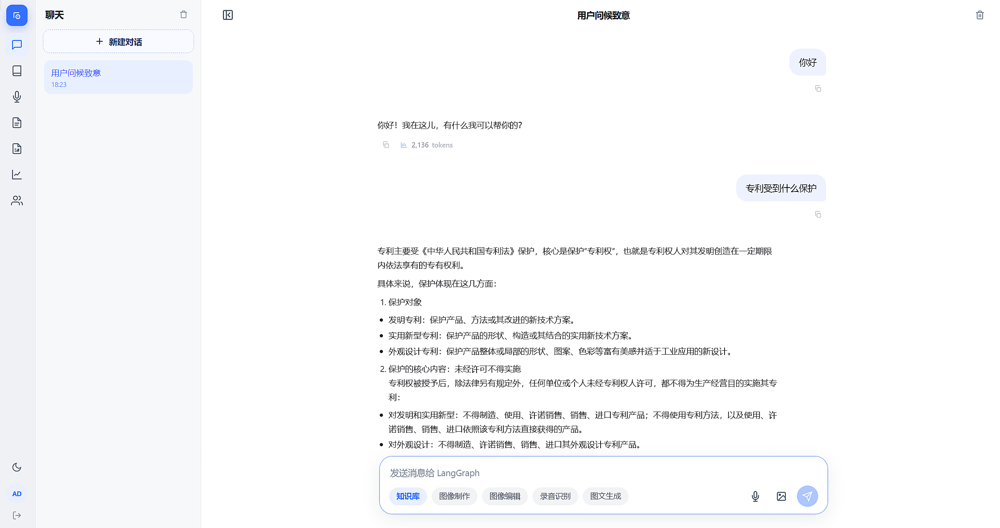
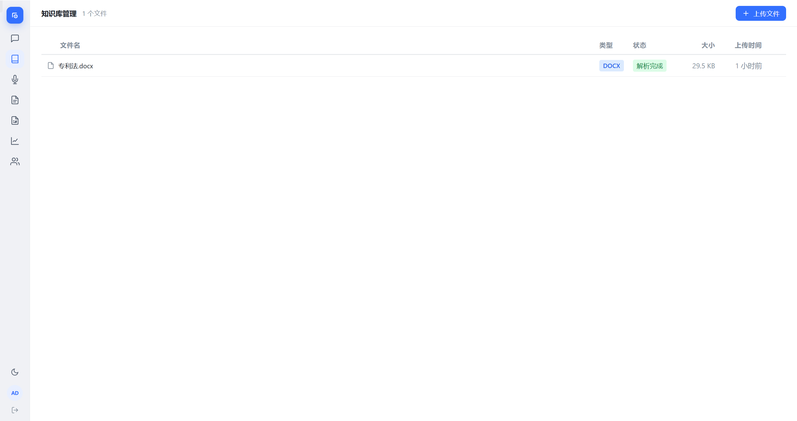
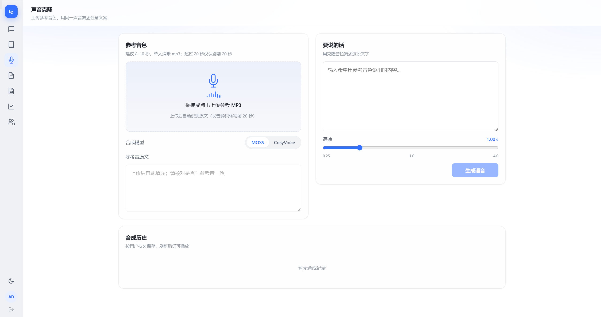
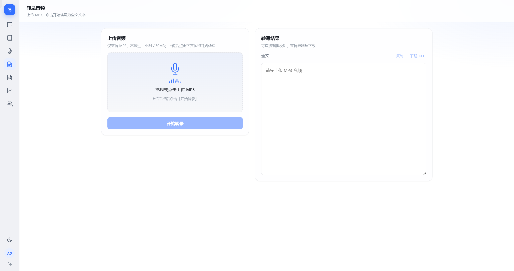
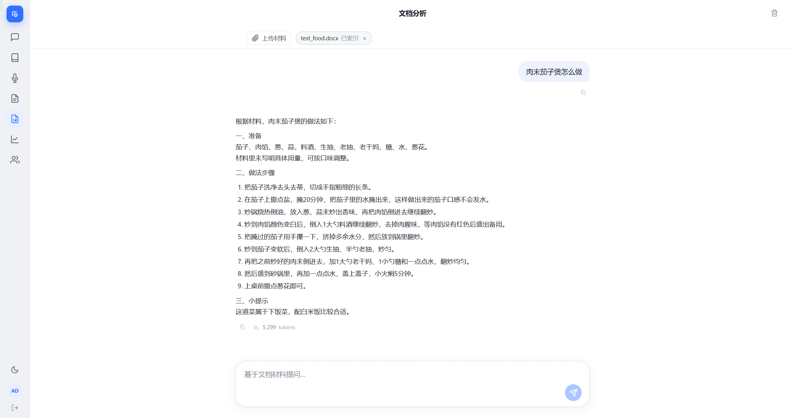
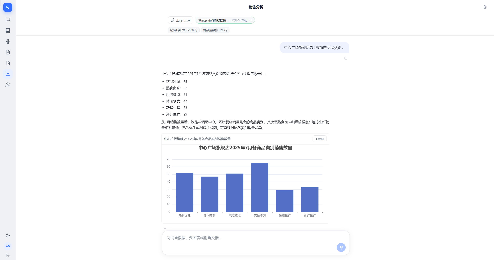
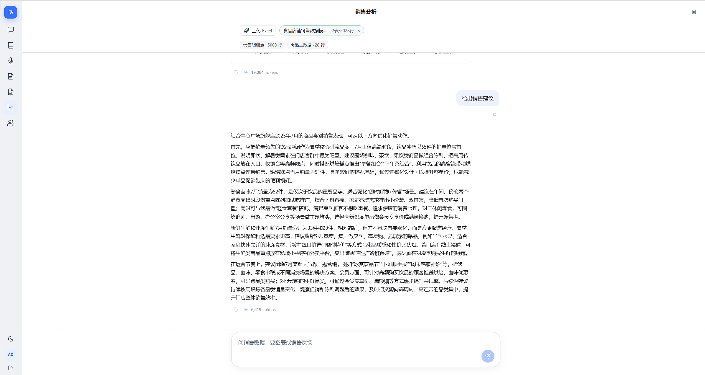
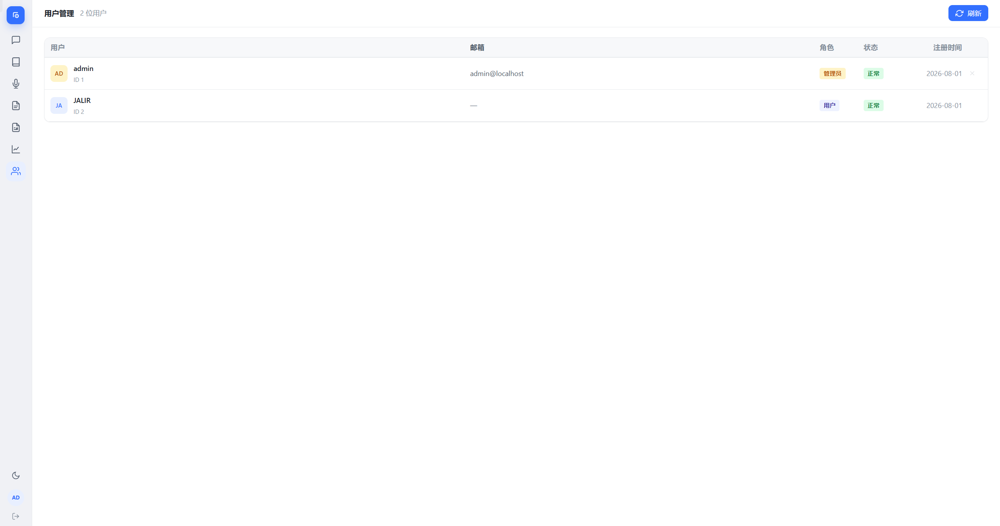

# AI Agent

面向企业内部场景的多工具智能助手：对话 Agent、知识库 RAG、文档 / 销售分析，以及文生图、图像编辑与语音能力。

后端 FastAPI · 前端 Vue 3 · 向量库 Milvus · 状态持久化 PostgreSQL。

仓库：[github.com/Jalir/AI-Agent](https://github.com/Jalir/AI-Agent)

---

## 核心能力

- **对话 Agent** — SSE 流式输出，意图路由，工具调用，敏感操作人工审批（HITL）
- **知识库 RAG** — 文档分层索引（Postgres + Milvus），Embedding 召回 + Rerank 精排，答案可回溯引用
- **业务工作区** — 临时文档问答 / 销售 Excel 自然语言分析，带 TTL 自动清理
- **多媒体** — 文生图、图像编辑、声音克隆、语音转写（支持 OpenAI 兼容 API；视觉链路可对接 ComfyUI 本地部署）
- **权限与运维** — 用户管理与能力权限；Docker / 裸机生产部署方案

---

## 界面预览

### 1. 知识库问答

基于已入库文档做 RAG 检索问答：Embedding 召回 + Rerank 精排，流式返回答案，并可回溯引用片段。



### 2. 知识库管理

维护知识库与文档：上传、分层索引、查看入库状态，支撑后续检索问答。



### 3. 声音克隆

上传参考音频，克隆音色后合成指定文本的语音，适合配音、培训讲解等场景。



### 4. 转录音频

上传语音文件，自动转写为文本，便于会议记录、素材整理与二次编辑。



### 5. 文档问答

临时工作区：上传文档后直接问答，无需写入长期知识库，到期自动清理。



### 6. Excel 数据分析

上传销售 / 业务 Excel，用自然语言提问，自动解析表格并给出分析结论。



### 7. 数据分析

面向业务指标与趋势的可视化分析视图，配合对话快速解读数据。



### 8. 用户管理

管理员维护账号与权限，控制谁可访问助手及各项能力。



---

## 架构

```text
Vue 3  ──►  Nginx / Vite  ──►  FastAPI
                                  │
                    ┌─────────────┼─────────────┐
                    ▼             ▼             ▼
               LangGraph      PostgreSQL      Milvus
               + Tools          (状态)        (向量)
```

工具放在 `backend/tools/{public,gated}/`，按目录约定即可扩展；`gated` 工具走人工审批后再执行。

---

## 技术栈

| 层级 | 选型 |
|---|---|
| Agent | LangGraph · LangChain |
| API | FastAPI · Uvicorn（单 worker，适配 SSE） |
| 前端 | Vue 3 · Vite · Pinia |
| 数据 | PostgreSQL · Milvus · 阿里云 OSS |
| 模型 | OpenAI 兼容 API（LLM / Embedding / 生图 / 语音）；可对接本地 ComfyUI |

---

## 快速开始

**准备**

```bash
cp backend/.env.example backend/.env
# 填好 LLM、Embedding、Postgres、OSS、JWT_SECRET
```

本地开发可用 Milvus Lite（默认 `MILVUS_URI=./milvus_demo.db`）；需要 Standalone 时执行 `docker compose up -d`。

**后端**

```bash
python -m venv .venv
# Windows: .\.venv\Scripts\Activate.ps1
# macOS/Linux: source .venv/bin/activate

pip install -r backend/requirements.txt
export PYTHONPATH=.   # Windows: $env:PYTHONPATH = (Get-Location).Path
uvicorn backend.main:app --host 0.0.0.0 --port 8000 --workers 1
```

**前端**

```bash
cd frontend && npm install && npm run dev
```

打开 [http://localhost:5173](http://localhost:5173)。健康检查：`/api/health`。

> 设置 `AUTH_ADMIN_PASSWORD` 后，首次启动会创建管理员。

---

## 生产部署

```bash
# 对照 deploy/env.prod.example 改好密钥与 CORS
docker compose -f docker-compose.prod.yml up -d --build
```

一键拉起 Postgres、Milvus、API、Nginx。默认监听 80。

**务必注意**

- API 保持单副本、单 worker（SSE 状态在进程内）
- 生产环境请使用 Milvus Standalone，不要用 Lite
- 不要把数据库 / Milvus 端口暴露到公网

裸机部署见 `deploy/systemd/` 与 `deploy/nginx.host.conf`。

---

## 项目结构

```text
backend/          API · Graph · Tools · RAG 索引
frontend/         Vue 3 SPA
deploy/           Nginx · systemd · 生产 env 示例
docker-compose*.yml
```

环境变量完整说明：[`backend/.env.example`](backend/.env.example)

---

## License

[MIT](LICENSE)
